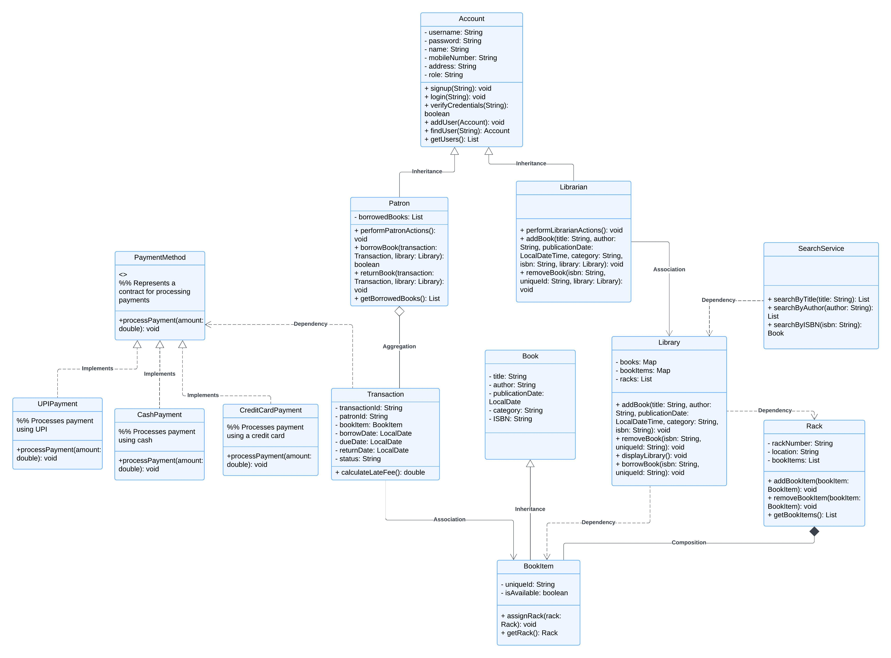

# Library Management System
This Library Management System is a comprehensive solution for managing books, users, and transactions in a library. The system allows users to borrow and return books, provides search functionality, and supports librarian-specific tasks such as adding and removing books.

The project is implemented using Java and follows an Object-Oriented Programming (OOP) approach to ensure modularity, scalability, and ease of maintenance.

## Key Features

The library management system offers a comprehensive set of features to streamline library operations and enhance user experience.

### User Management

#### Librarian:

* Manage the library's book collection by adding or removing books.
* Organize books efficiently by creating and managing racks for physical placement.

#### Patron:

* Borrow books (with a limit of 5 books at a time) to enjoy comfortable reading at home.
* Easily return borrowed books to keep their borrowing privileges up-to-date.

### Book Management

* Create detailed entries for each book in the library collection, including:
    * Title
    * Author(s)
    * Publication Date
    * Category (e.g., fiction, non-fiction, reference)
    * ISBN (International Standard Book Number) for unique identification
* Manage multiple copies (BookItems) of each book, each with a distinct ID for better organization.
* Assign books to specific racks for a well-organized physical library layout.

### Library Features

* Librarians can effortlessly add new books to the collection and dynamically assign them to appropriate racks.
* Remove books from the system, including the deletion of specific copies (BookItems).
* Generate reports that display the entire library contents, including details about book locations (racks) and individual book information.

### Payment Management

* The system accommodates multiple payment methods to ensure a convenient user experience:
    * Cash
    * Credit Card
    * UPI (Unified Payments Interface) for cashless transactions in India

### Transaction Management

* Maintain meticulous records of borrowed and returned books to keep track of book circulation.
* Calculate any late fees incurred based on pre-defined due dates to ensure timely book returns.

### Search Functionality

* Patrons can leverage the intuitive SearchService to find books quickly using:
    * Book title
    * Author(s)
    * ISBN

## Class Diagram

### Library management System

 
## Class Descriptions

This section details the core classes and functionalities within the library management system.

**1. Account**

The `Account` class serves as the foundation for user accounts in the system. It defines essential attributes and methods common to both librarians and patrons.

**Attributes:**

* `username`: Username for login (String)
* `password`: Password for login (String)
* `name`: User's full name (String)
* `mobileNumber`: User's mobile phone number (String)
* `address`: User's address (String)
* `role`: User's role (e.g., "librarian", "patron") (String)

**Key Methods:**

* `signup(String username, String password, ...)`: Registers a new user with the system.
* `login(String username, String password, String role)`: Validates user credentials and logs them into the system.

**2. Librarian (Subclass of Account)**

The `Librarian` class inherits from `Account` and represents librarian users. Librarians can perform tasks specific to managing the library's book collection.

**Key Methods:**

* `addBook(String title, ...)`: Adds a new book entry to the library system.
* `removeBook(String isbn, ...)`: Removes a book or specific copies of a book from the library.

**3. Patron (Subclass of Account)**

The `Patron` class inherits from `Account` and represents patron users. Patrons can borrow and return books from the library.

**Key Methods:**

* `borrowBook(Transaction transaction, Library library)`: Initiates the borrowing process for a book.
* `returnBook(Transaction transaction, Library library)`: Returns a previously borrowed book.

**4. Book**

The `Book` class represents a book entity within the library system. It encapsulates core information about a book.

**Attributes:**

* `title`: Title of the book (String)
* `author(s)`: Author(s) of the book (String)
* `publicationDate`: Date of publication (String)
* `category`: Category of the book (e.g., "fiction", "non-fiction") (String)
* `ISBN`: International Standard Book Number (unique identifier) (String)

**5. BookItem (Subclass of Book)**

The `BookItem` class inherits from `Book` and represents individual copies of a book in the library.

**Attributes:**

* `uniqueId`: Unique identifier for each book copy (String)
* `isAvailable`: Availability status of the book copy (Boolean)
* `rack`: Rack where the book copy is currently located (Rack object)

**6. Library**

The `Library` class acts as the central hub for managing the library's inventory and operations. It interacts with various other classes to facilitate book management, borrowing, and searching.

**Key Attributes:**

* `books`: Dictionary storing book entries indexed by ISBN (ISBN: Book object)
* `bookItems`: Dictionary tracking individual book copies (uniqueId: BookItem object)
* `racks`: List containing all book racks (list of Rack objects)

**Key Methods:**

* `addBook(...)`: Adds a new book and its copies to the library.
* `removeBook(...)`: Removes a book or specific copies from the library.
* `displayLibraryContents()`: Generates a report showcasing all racks and their book contents.
* `borrowBook(String isbn, Patron patron)`: Initiates the borrowing process for a book by a patron.

**7. Rack**

The `Rack` class represents a physical storage unit within the library for organizing book copies.

**Attributes:**

* `rackNumber`: Unique identifier for the rack (String)
* `bookItems`: List of book copies currently on the rack (list of BookItem objects)

**Key Methods:**

* `addBookItem(BookItem bookItem)`: Adds a book copy to the rack.
* `removeBookItem(BookItem bookItem)`: Removes a book copy from the rack.

**8. Transaction**

The `Transaction` class manages the details of borrowing and returning books.

**Attributes:**

* `transactionId`: Unique identifier for each transaction (String)
* `patronId`: Identifier of the patron involved in the transaction (String)
* `bookItem`: The specific book copy involved in the transaction (BookItem object)
* `borrowDate`: Date and time when the book was borrowed (Date/Time object)
* `dueDate`: Date and time when the book is due to be returned (Date/Time object)
* `returnDate`: Date and time when the book was actually returned (Date/Time object)
* `status`: Status of the transaction (e.g., "borrowed", "returned", "overdue") (String)

**Key Methods:**

* `calculateLateFee()`: Calculates any late fees incurred based on the due date and return date.

**9. PaymentMethod (Interface)**

The `PaymentMethod` interface defines the standard for handling different payment methods used for transactions within the library system. Specific payment methods like cash, credit card, and UPI payments will implement this interface.

### Implementations:

* `CashPayment`
* `CreditCardPayment`
* `UPIPayment` (for cashless transactions)

**10. SearchService**

The `SearchService` class provides functionalities to search for books within the library system.

**Key Methods:**

* `searchByTitle(String title)`: Searches for books based on title.
* `searchByAuthor(String author)`: Searches for books based on author(s).
* `searchByISBN(String isbn)`: Searches for a book using its ISBN

## Flow of the Project
**1. User Signup/Login**

* A user (Librarian or Patron) registers an account with a username, password, and other details.
* During login, users provide credentials and select their role to access role-specific functionality.

**2. Library Management (Librarian)**

* The librarian manages the inventory by:
    * Adding new books to the library.
    * Assigning book copies (BookItem) to specific racks.
    * Removing books or book copies from the inventory.

**3. Book Browsing and Borrowing (Patron)**

* Patrons browse the library’s collection using the SearchService by searching for books by title, author, or ISBN.
* Patrons can borrow up to 5 books at a time.
* When borrowing, the system:
    * Updates the availability of the BookItem.
    * Creates a Transaction to track the borrowing details (borrow date, due date).

**4. Book Returning**

* Patrons return borrowed books to the library.
* Upon return:
    * The system updates the BookItem status to available.
    * Calculates late fees (if applicable) based on the return date and due date.

**5. Search Functionality**

* Both librarians and patrons can use the SearchService to find books by:
    * Title
    * Author
    * ISBN

**6. Payment Management**

* For late fees or other charges, patrons can process payments using multiple payment methods:
    * CashPayment
    * CreditCardPayment
    * UPIPayment

**7. Library Display**

* The librarian can view the library’s contents, including details about:
    * Books and their copies (BookItem).
    * Racks and their associated books.

 ## How to Run the Project
  **1.** Clone the repository or download the source files.

  **2.** Compile and run the main program in your Java IDE (e.g., IntelliJ, Eclipse).

  
  **3.** Use the console interface to perform user-specific tasks.

